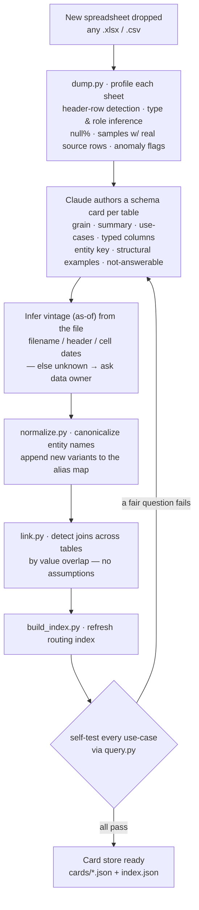
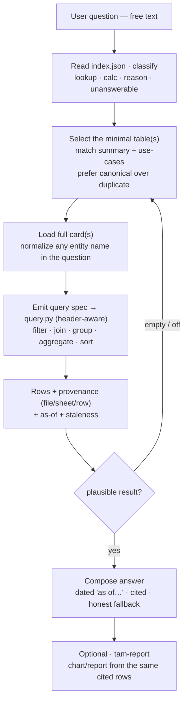

# TAM Intelligence — process diagrams

Rendered version: `produced_data/reports/tam_flows.html` (also published as an Artifact).

## Pipeline A — Ingestion (`tam-ingest`)

Same procedure for every file; assumes nothing about the subject, only that it is a spreadsheet.

## Pipeline B — Querying (`tam-ask` / `tam-report`)

## Packaging & sharing

A skill file alone is not enough — the cards, alias map, engine scripts, and the actual
**data files** must travel together, because `query.py` reads the source sheets live.

**Ships as one package:** `.claude/skills/tam-{ingest,ask,report}` · `code/tam/*.py` ·
`produced_data/cards/` (+ `index.json`) · `produced_data/pipeline/data/aliases.csv` ·
`input_data/` (source spreadsheets).

| Option | For whom | Notes |
|---|---|---|
| **Shared internal repo + Claude Code** _(recommended)_ | Anyone who can open a repo in Claude Code | The repo *is* the package — skills auto-discovered, paths resolve, access = repo permissions, versioned/updatable. |
| **Shared Project on claude.ai** | Sales reps who live in claude.ai | Data + cards + scripts in a Team/Enterprise Project; skills added as org Skills. Needs a one-time bundle + a configurable data-root. |

**Confidentiality:** internal EXL competitive intelligence — distribute only within the org
(private repo / Enterprise workspace); never publish publicly.
